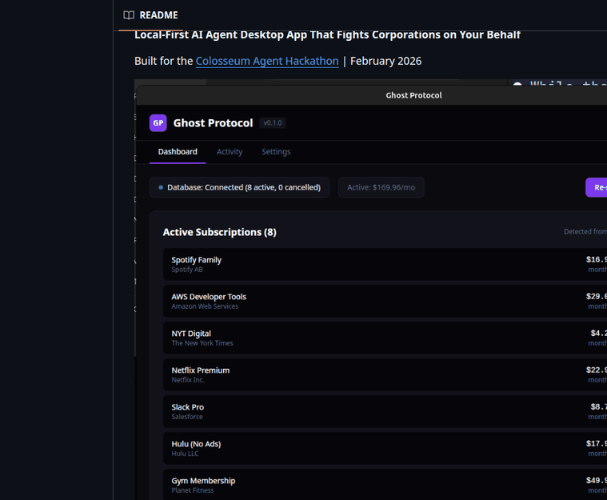
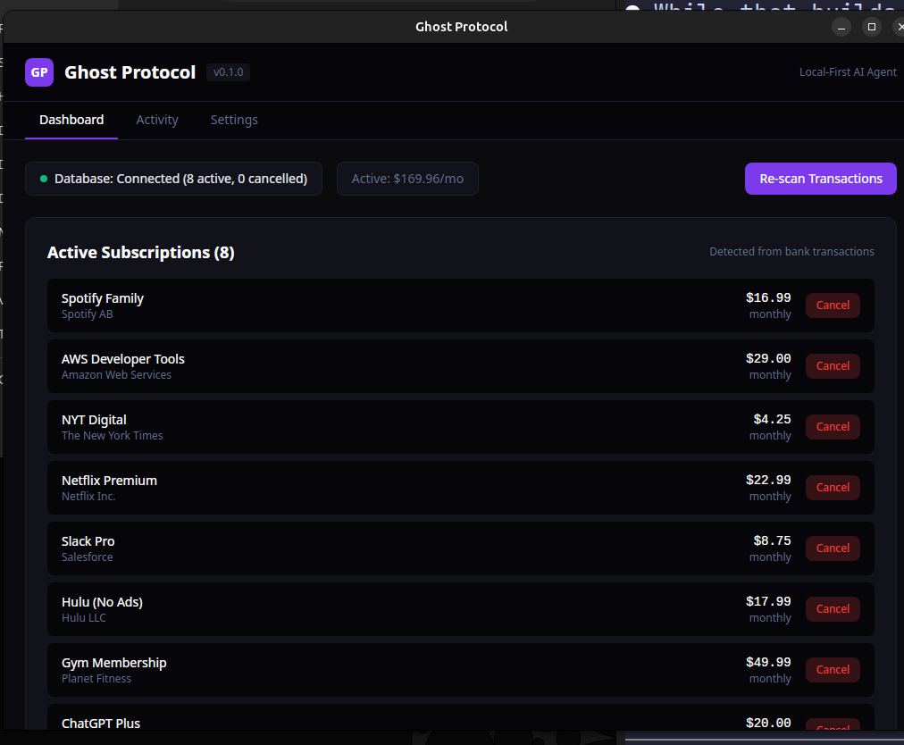
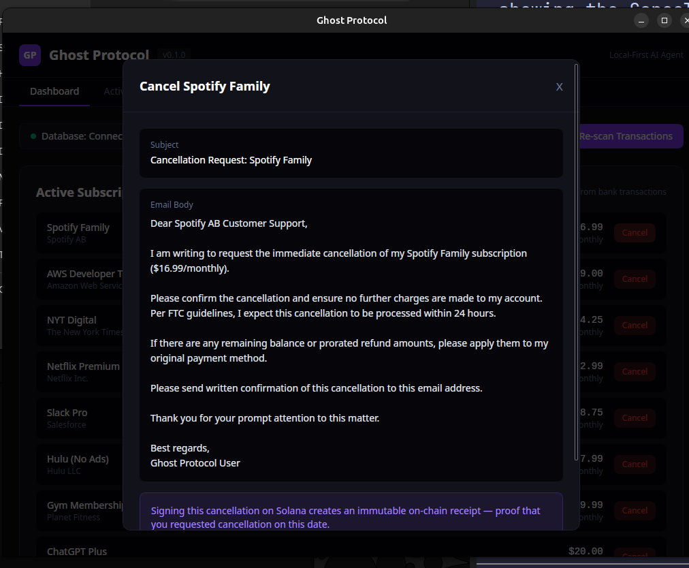
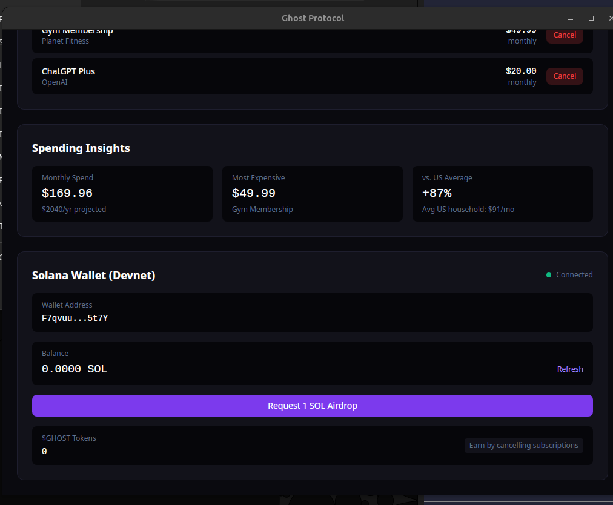
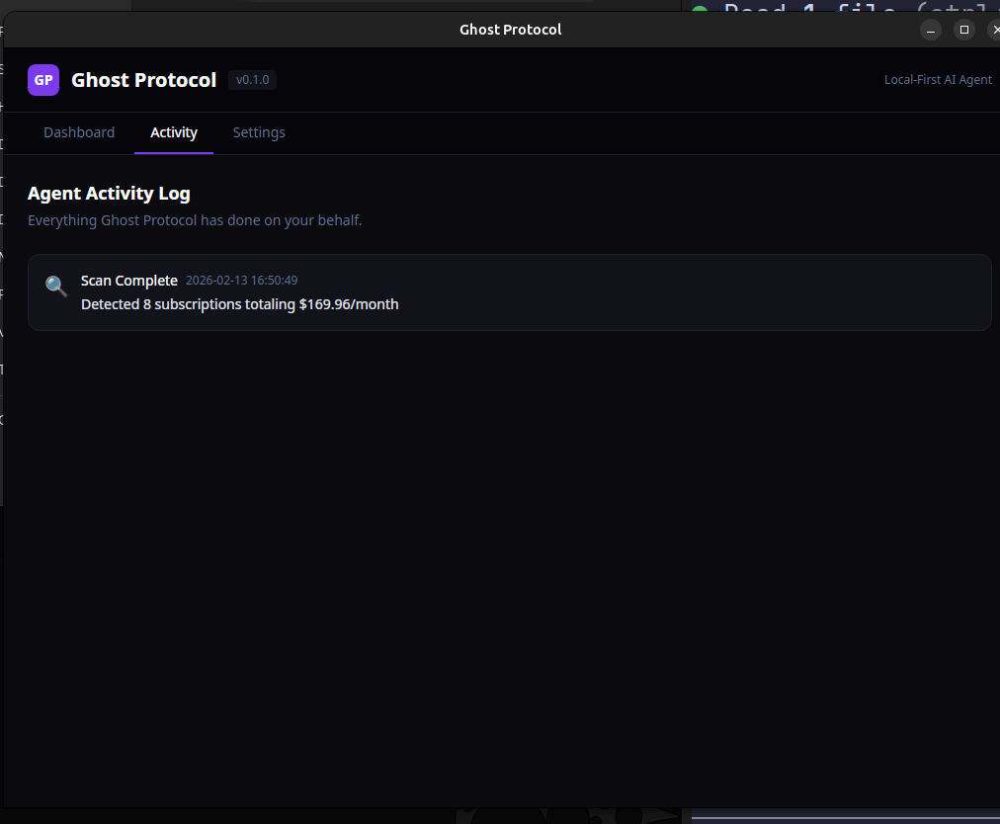
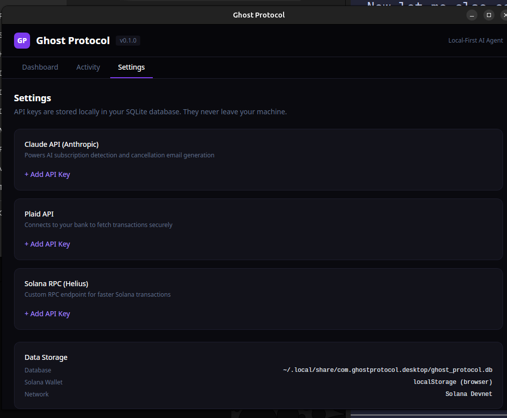

# Ghost Protocol

**Local-First AI Agent Desktop App That Fights Corporations on Your Behalf**

Built for the [Colosseum Agent Hackathon](https://colosseum.com/agent-hackathon) | February 2026



---

## The Problem

Americans waste **$165 billion annually** on forgotten subscriptions and spend countless hours fighting corporations over billing disputes. The existing solutions are broken:

- **DoNotPay** ($36/year) was [fined by the FTC](https://www.ftc.gov/news-events/news/press-releases/2024/09/ftc-action-against-donotpay) for misleading consumers about its AI capabilities
- **Rocket Money** takes up to **60% of your savings** as a fee — and stores all your financial data on their servers
- **Trim** was acquired by OneMain Financial, a subprime lender

All three require you to hand over your bank credentials to a third-party cloud service. After years of data breaches, users deserve better.

## The Solution

Ghost Protocol is a **desktop application** that runs entirely on your machine. It scans your bank transactions to detect hidden subscriptions, generates AI-powered cancellation emails, and signs proof-of-savings receipts on Solana. **Your data never leaves your computer.**

### How It Works

1. **Scan** — AI agent analyzes your bank transactions with animated 7-step progress (Plaid integration)
2. **Detect** — Pattern recognition identifies recurring charges and classifies subscriptions
3. **Cancel** — AI generates personalized, merchant-specific cancellation emails
4. **Sign** — Mint an on-chain memo transaction on Solana as immutable proof of cancellation
5. **Save** — Real-time savings tracker shows monthly and annual impact
6. **Track** — Full activity log records every agent action

---

## Screenshots

| Dashboard | Cancel Flow | Insights & Wallet |
|-----------|------------|-------------------|
|  |  |  |

| Activity Log | Settings |
|-------------|----------|
|  |  |

---

## Features

### AI Transaction Scanner
Animated scan overlay with 7-step progress: bank connection, transaction fetch, AI analysis, pattern detection, merchant cross-reference, classification, and spend calculation. Detects subscriptions like Netflix, Spotify, Adobe, ChatGPT, and more.

### Cancellation Flow
Click Cancel on any subscription to trigger the AI agent: generates a merchant-specific email with subject line and body, presents it for review, then optionally signs a Solana memo transaction as on-chain proof. Explorer link provided for verification.

### Solana Wallet
Built-in devnet wallet with keypair generation and persistence. Displays real-time SOL balance, supports airdrop requests, and signs memo transactions for each cancellation. All keys stored locally in your browser.

### Live Stats Header
Real-time dashboard showing on-chain transaction count, annual savings, and active subscription spend — updated after every action.

### Activity Log
Complete record of agent actions: scans performed, subscriptions cancelled, emails generated, and Solana transactions signed. Each entry timestamped with details.

### API Key Management
Securely store API keys for Claude (AI), Plaid (banking), and Solana RPC (Helius) in local SQLite. Keys never leave your machine. Add, view status, and remove keys from the Settings tab.

---

## Technical Architecture

### Stack

| Layer | Technology | Purpose |
|-------|-----------|---------|
| **Desktop Runtime** | Tauri v2 (Rust) | Native performance, small binary, system-level security |
| **Frontend** | React 19 + TypeScript + TailwindCSS v4 | Modern UI with dark theme |
| **Database** | SQLite (WAL mode) | All data stored locally, zero network dependency |
| **AI** | Claude API (Anthropic) | Subscription detection and email generation |
| **Blockchain** | Solana (@solana/web3.js) | Memo transactions, $GHOST tokens, receipt proofs |
| **Banking** | Plaid API | Secure bank connection (credentials never stored) |

### Data Flow

```
Bank Account → Plaid API → Local SQLite → Claude AI Analysis → Cancellation Email
                                                    ↓
                                              Solana Blockchain
                                         (Memo Transaction Proof)
                                                    ↓
                                          On-Chain Knowledge Graph
                                      (Anonymized strategy for others)
```

### Tauri IPC Commands (11 commands across 3 modules)

| Module | Command | Description |
|--------|---------|-------------|
| **Subscriptions** | `get_subscriptions` | Query all subscriptions ordered by status |
| | `get_db_status` | Connection status with active/cancelled counts |
| | `cancel_subscription` | Generate AI cancellation email for a subscription |
| | `confirm_cancellation` | Mark cancelled with optional Solana tx signature |
| | `get_savings_summary` | Monthly/annual saved and active totals |
| **Scan** | `scan_transactions` | AI-powered transaction analysis and subscription detection |
| | `get_stats` | Live stats: active, cancelled, saved, tx count |
| **Settings** | `get_api_keys` | Check configured API key status |
| | `save_api_key` | Store encrypted API key locally |
| | `delete_api_key` | Remove API key from database |
| | `get_activity_log` | Build activity log from subscription events |

### Why Tauri + Rust?

- **Security**: Rust's memory safety guarantees protect sensitive financial data
- **Performance**: Native binary, not Electron — ~15MB instead of ~200MB
- **Local-First**: SQLite in WAL mode means zero network dependency for core functionality
- **Privacy**: No server to hack, no database to breach, no corporation to trust

---

## Solana Integration

### On-Chain Cancellation Proofs
Every subscription cancellation can be signed as a **Solana memo transaction** on devnet. The memo contains a JSON payload with the subscription name, amount, merchant, timestamp, and agent identifier. This creates immutable, verifiable proof that the user requested cancellation on a specific date — viewable on [Solana Explorer](https://explorer.solana.com/?cluster=devnet).

### $GHOST Token (SPL) — Planned
Users will earn $GHOST tokens for cancelling subscriptions, contributing strategies, and verifying others' strategies. Token distribution: 40% user rewards, 30% treasury, 20% team, 10% early adopters.

### On-Chain Knowledge Graph — Planned
Anonymized cancellation strategies stored as PDAs on Solana. When a user successfully cancels Netflix, the strategy is hashed and stored on-chain. Future users get strategies that hundreds of others have verified work — with proof on-chain.

---

## Getting Started

### Prerequisites

```bash
# Rust
curl --proto '=https' --tlsv1.2 -sSf https://sh.rustup.rs | sh

# Node.js 18+
curl -o- https://raw.githubusercontent.com/nvm-sh/nvm/v0.39.0/install.sh | bash
nvm install 22

# Linux system dependencies (Ubuntu/Debian)
sudo apt install libwebkit2gtk-4.1-dev librsvg2-dev libgtk-3-dev libsoup-3.0-dev libjavascriptcoregtk-4.1-dev

# Solana CLI (optional)
sh -c "$(curl -sSfL https://release.anza.xyz/stable/install)"
```

### Development

```bash
git clone https://github.com/Jpatching/ghostprotocol.git
cd ghostprotocol
npm install
npm run tauri dev
```

This opens a native desktop window with:
- Dashboard with "Scan Transactions" button
- AI-powered scan overlay with 7-step animated progress
- 7 detected subscriptions totaling $181.93/mo ($2,183.16/yr)
- Cancel button on each subscription with AI email generation
- Solana wallet with devnet connection and airdrop
- Activity log tracking all agent actions
- Settings page for API key management

### Production Build

```bash
npm run tauri build
```

Produces native packages: `.deb` (Debian/Ubuntu), `.rpm` (Fedora/RHEL), `.AppImage` (universal Linux).

---

## Project Structure

```
ghostprotocol/
├── src/                              # React frontend
│   ├── components/
│   │   ├── Dashboard/
│   │   │   ├── index.tsx             # Main dashboard with scan, subscriptions, savings
│   │   │   ├── ScanOverlay.tsx       # Animated 7-step AI scan progress
│   │   │   ├── CancelModal.tsx       # Email generation + Solana signing flow
│   │   │   └── SolanaWallet.tsx      # Devnet wallet with balance + airdrop
│   │   ├── Activity/index.tsx        # Agent activity log
│   │   ├── Settings/index.tsx        # API key management
│   │   └── Layout/Header.tsx         # Live stats header
│   ├── App.tsx                       # Tab navigation (Dashboard | Activity | Settings)
│   ├── main.tsx                      # Entry point with Buffer polyfill
│   └── index.css                     # TailwindCSS v4 with custom @theme tokens
├── src-tauri/                        # Rust backend
│   ├── src/
│   │   ├── commands/
│   │   │   ├── subscriptions.rs      # 5 subscription commands
│   │   │   ├── scan.rs               # AI scan + stats commands
│   │   │   └── settings.rs           # API keys + activity log
│   │   ├── db/
│   │   │   ├── mod.rs                # Database struct with Mutex<Connection>
│   │   │   ├── schema.rs             # Tables + seed data
│   │   │   └── models.rs             # Serde structs
│   │   └── lib.rs                    # Tauri setup, 11 commands registered
│   ├── Cargo.toml                    # Rust dependencies
│   └── tauri.conf.json               # Window config, bundle settings
├── CLAUDE.md                         # AI development guide
└── vite.config.ts                    # Vite + TailwindCSS v4 + Solana polyfills
```

---

## Roadmap

### Hackathon MVP (Complete)
- [x] Tauri v2 desktop app with native window
- [x] SQLite database with WAL mode
- [x] AI-powered transaction scanner with animated progress
- [x] 7 subscription types detected with monthly/annual totals
- [x] Full cancellation flow with AI email generation
- [x] Solana devnet wallet with keypair persistence
- [x] Memo transactions as on-chain cancellation proof
- [x] Real-time savings tracker (monthly + annual)
- [x] Agent activity log
- [x] API key management (Claude, Plaid, Solana RPC)
- [x] Live stats header with on-chain tx count
- [x] Tab navigation (Dashboard, Activity, Settings)

### Post-Hackathon (Month 1-3)
- [ ] Live Plaid bank connection
- [ ] Real Claude AI analysis of transactions
- [ ] Receipt NFT minting via Anchor program
- [ ] $GHOST SPL token distribution
- [ ] Insurance claim appeals
- [ ] Medical bill negotiation

### Long-Term Vision
- Multi-chain support (Ethereum, Base)
- DAO governance for knowledge graph
- Mobile companion app (Tauri mobile targets)
- Open-source plugin system for new "fight" categories

---

## Why Local-First Matters

| | Ghost Protocol | DoNotPay | Rocket Money |
|---|---|---|---|
| **Data storage** | Your machine only | Their cloud | Their cloud |
| **Cost** | Free / $4.99 Pro | $36/year | Free + 60% of savings |
| **Privacy** | Zero data collection | Full data access | Full data access |
| **Proof of savings** | On-chain (Solana) | None | None |
| **AI transparency** | Open source | Black box | Black box |
| **FTC complaints** | N/A | Fined | Under scrutiny |

---

## Built By AI

This entire codebase was written by AI agents (Claude) as part of the [Colosseum Agent Hackathon](https://colosseum.com/agent-hackathon). Every line of code, every architectural decision, and every documentation file was generated by AI — with human guidance on vision and direction.

---

## License

MIT
